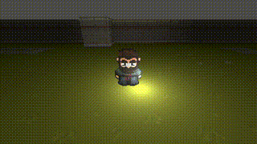

# Requirements

## Using Git LFS

This project uses Git LFS (Large File Storage) to handle large files. Before cloning or working with the repository, make sure you have Git LFS installed on your machine.

### Installing Git LFS

You can download Git LFS from [here](https://git-lfs.github.com/), or by executing the following command in your machine:

```
git lfs install
```

After installing Git LFS, the large files in this repository will be automatically handled. No additional configuration is needed.


## Test Goals

The goal of this project is to practice common game development processes. For this, Godot 4.2.1 is being used. Random topics are chosen based on personal interests.


**E000:** *2D in 3D*


