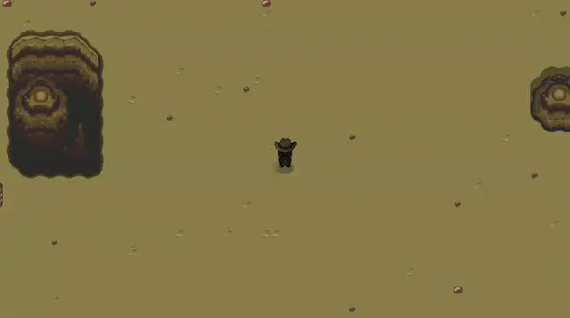
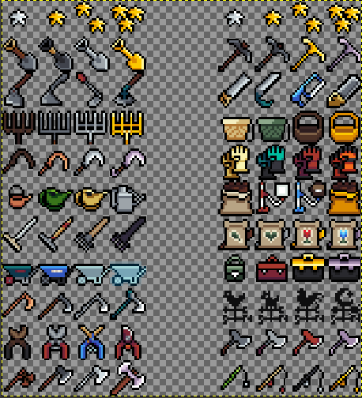
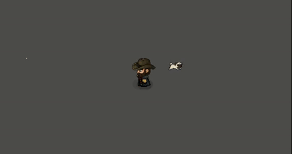
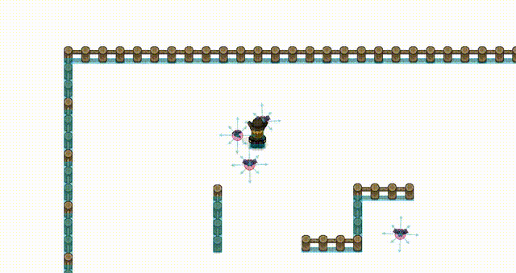

# Goal

The goal of this project is to practice common game development processes for curiosity. For this, Godot 4.4 is currently being used. Random topics are chosen based on personal interests. Everything shall be considered an endless work in progress with no coherence or expectations. The point is to make this a quick and enjoyable exploration.

# Opening Sequence Mockup

[Alcarodian Dungeons Opening Sequence](https://www.youtube.com/watch?v=roq8450G_l8 "https://www.youtube.com/watch?v=roq8450G_l8")

# Spotlight

*(Loading GIFs might take a while...)*

**E022: GOAP AI System**

# Experiments

**E025: First Dungeon + Rolling & Gathering**

---

**E024: Day & Night Cycle**

Followed bitbrain's video to implement a Day Night Cycle component in the levels. I highly recommend it: [https://www.youtube.com/watch?v=HjwWe-V3nHs](https://www.youtube.com/watch?v=HjwWe-V3nHs "Day &amp; Night Cycle in under 8 minutes! Godot 4.0 Tutorial")

With the use of shaders I am trying to enhance the visuals of the scene with some sunrays taken from Godot's Shaders website ([https://godotshaders.com/shader/god-rays/](https://godotshaders.com/shader/god-rays/ "God rays by pend00")) and currently looking to make the firepit illuminate in a better way, implement shadows or contrast. The sample video is sped up significantly, the original idea is 10 real-life minutes = 1 in-game hour.

---

**E023: Fireball + Shaders**

Laid the fundation of the structure of what the magic/combat system might look like. At the same time I introduced myself to the magic of shaders to create the heatwave. I am impressed and recently very inspired by how the game Balatro managed to create, as someone else said: digital crack. Shaders will be something I must master, because I really think it makes a huge difference in 2D games more now than ever. They can be a strong addictive factor if the art is very good too, like in Balatro, holographic, the creative and colorful joker cards, the CTR old tv theme, they all blent so good. (By the way, found this cool seed to try with a Yellow Deck. It gives you the Homeless Joker Card and a +1 hand voucher in the very first shop, creating a very fun set that relies on tarot cards: 4WBAP4QZ). There are plenty of tweaks that need to be done, like hiding the shader's outline box when cast, enhance the controls and speed to make the gameplay feel better...

---

**E022: GOAP AI System**

This is it. What I dreamed about since January, almost a year ago. This is the day I pictured I'd never reach, but here it is, it's finally here. After a month and a half of hard work, I am proud to say I finally finished learning and building a GOAP AI System for my NPCs. GOAP AI, (Goal-Oriented Action Planning Artificial Intelligence), was created by Jeff Orkin around 2006 for the game F.E.A.R. I highly recommend AI and Games' video about it, including the interview with Jeff himself: [https://youtu.be/3Of2NtTYcvU?si=4kvQLxwkzxZtrNSQ](https://youtu.be/3Of2NtTYcvU?si=4kvQLxwkzxZtrNSQ "AI and Games")

I borrowed some of Godot dev Bitbrain's Beehave (BehaviorTrees AI plugin author) features to be able to control how many times GOAP runs, that is, I connected it to a Tick System, like Runescape. Every 20 frames, it runs, and it can be switched OFF/ON along the Behavior Tree to be able to use two different AI systems in an NPC. For now, it's very simple, I use BT for simple scripted stuff like wandering around and being idle, and I plan to use GOAP for the complex juicy stuff like combat or work. As of right now, while the NPC is idle, it uses the BT to just wander around mindlessly and randomly, and when the player is nearby, it follows it until it loses it from sight. Now, I added a button that says "Build a firepit!", that, when pressed, it sends such 'order' to the NPC, so, this is the moment when its BT is turned off and the GOAP is turned on. The priority for the goal of building a firepit is increased artificially for now, but I might create a more dynamic system for that in the future, same for the costs, as the game grows.

For now, the GOAP created a plan with three actions: chop_tree, collect_wood, build_firepit. Chopping wood in this game drops the logs on the ground as collectables you must walk over to pick them up.

To build a firepit, the NPC must be able to see a tree within its detection area. For now, I ignored plenty of potential errors and crashes I get if there are no trees nearby and things like that, I focused solely on building the firepit with what is valid. So, currently, if there is no tree nearby, the game crashes, however, if there is one, or two or more, the entity will choose the closest one, and then it will start walking towards it. I spent a lot of time here creating a system capable of avoiding the player or other NPCs that are on its way, it walks around them by using the ContextMap I created in E009. I plan to make this even better by manipulating the interest/danger values inside the ContextMap instead of the hardcoded solution I came up with, which is a little weird, simple, but weird, and it sometimes makes the entity look too dumb or still get stuck in some corners, but at least it still works well enough to get the job done. The entity will move to either the left or right side if the player is above or below it, up or down if it's on any side, same for the trees, the trees have an interaction area you must overlap with a tiny slim rectangle collision shape the player, and also the humanoid NPCs have all the same. I had to fix an error with the NPC getting stuck for so long trying to stick that thing properly inside, however, with a circular shape on the inner end of such interactor shape, the entity now bounces away if it gets stuck. This way, entities should be capable of positioning themselves correctly to be able to interact with any kind of interaction area / collision shapes, unless they are some super weird polygons or whatever. After positioning itself correctly, it interacts with the tree, just like the player in the collectables experiment, E012, every few seconds until the enough amount of wood it needs is on the ground. Here, if the player picks some of them up while it's still working on chopping it or collecting it, it returns to chopping some more wood. I did this because I'd like to someday make them chop wood non-stop and have some other NPC collecting them, two NPCs working together to make a more efficient work, just like in Rimworld sometimes. Anyways, after chop_tree is done (if wood_in_inventory + wood_on_ground >= wood_needed), it moves to the next step of the plan, collect_wood, which does what it says, it moves the entity towards the closest collectable that is wood, repeating until it picks them all up. They are added to its inventory, which is still a very simple and unfinished system I plan to expand much later. With the necessary amount of wood in its inventory, it runs the perform of build_firepit which at first I used multithreading to instantiate the firepit and generate up to 7 different attempts of radom positions it can place the firepit on without being somewhere unreachable, that is, it shouldn't overlap with any other body/collision shape of certain groups. For now I kept it simple and it only detects trees, but maybe later I will need to do the same for other firepits or structures. I encountered difficult bugs regarding multithreading and when are collisions ran, I actually managed to get multithreading work perfectly, except for the moment has_overlapping_bodies was running, it'd always return false no matter what. I ended up discaring the use of multithreading, but the problem with is_overlapping_bodies was still happening, and that took a long time to fix, same for the chop_tree action and its quirks. However, it got solved by using signals, and some other important tweaks that not make me feel confident the entity will never build the firepit where it shouldn't. I currently delete the area/collisionshape I use from the firepit to calculate those overlaps, but I might keep it to be able to avoid building on top of them. I might also need to give the entity a certain amount of attempts so it avoids looping forever, and I guess that's it, I got the base for something that can be reused in a lot of things. Picking up tools, weapons, doing other kinds of work, like mining, cooking, crafting, etc. I feel I made some of the most important and core features regarding the movement and positioning of the entity. There is still a lot that can be done, but for now, it works and it works well.

**TL;DR:**

[+] The entity can switch between a BT and GOAP AI Systems. BT is useful for decorative simple stuff like wandering around, following something or someone, being idle... The GOAP is better for complex stuff, like combat or work.

[+] Right now, the entity can receive the order of building a firepit. It'll build this plan: chop_tree, collect_wood, build_firepit.

[+] During chop_tree, the entity will choose the nearest tree and move toward it, avoiding other entities or obstacles like walls and fences. It will also position itself correctly in front of the tree, avoiding getting stuck on corners or weird spots. It works exactly as if it was another player.

[+] After having chopped enough wood (in_inventory + on_ground >= needed_amount), it will move to collect_wood, which simply makes it move toward the collectables. If someone else picks them up, the entity restarts the same plan, returning back to chopping a tree.

[+] After having enough wood in its inventory, it will attempt to place the firepit somewhere reachable, that is, somewhere it doesn't overlap with another structure's collision shape or body.

[+] After it's done, it switches back to the BT and idles around. This base simple system shall be easy to expand for other jobs like mining or crafting. Combat and more will be the most interesting ones to build, playing with priorities and costs more in-depth.

I finally feel free.

---

**E021: Hanging Objects**

A sample of hanging objects. Used rigidbodies and a small logic to avoid pulling it in bizarre manners, that is, "hold" the hanging object for a second, then "let it go". A very simple timer to fix that innevitable bug, there was no other way around it, one-way collisions, using four segment collisions, etc. Also, small teaser of the upcoming rain mechanic. I am currently refactoring the way levels are done, by treating again, like the Human Body experiment, everything is a component in it, Space, Time... and something to play with the weather, rain, wind that moves (skews based on wind strength) the plants, seasons, precipitation, rain chance, temperature... Designing this is proving to be a challenge, so I am going to spend more time on other projects while I work this out. Not having a source of income is becoming a difficult toll too, I don't think I should continue with these anymore, I think I am not developing skills that will land me a job here in Mexico or USA, it wasn't enough.

---

**E020: Plants & Grass**

Can generate a set amount on the given area. Planning to see if concurrency can be used for the upcoming wind simulation, or something to help this great amount of sprites. Might create circular and triangular areas to be able to cover absolutely any 2D surface possible.

---

**E019: AI Refactor**

Another big one. Spent about a month refactoring the AI system, mimicking the structure I used for the human body: there is a controller for every entity's AI that gives it the direction to move or action to do based on the current situation or context. I ended creating my own baby AI system with no help by upgrading the Utility AI I had with State Machines, a kind of hybrid that simply runs a Start(), Update() and End() function given the Utility AI's Agent chosen priority action. It is still not complete, I have yet to implement the combat, which requires me to design a Situational Awareness system, something that judges the current situation more profoundly, to play with its priorities. For this, I read that GOAP is best, although it is also the heaviest regarding performance. I'd use it only for humanoid enemies, not small critters like a bat, which shine the most when using simpler AIs like my Utility/STM hybrid one. GOAP, and possibly in the future, neural training and machine learning if possible, will be used just for learning purposes. Although if successful, I think it'd be crazy. Godot has made it so easy to design everything in a very scalable way; I just have spent a lot of time designing these things, trials and errors and such to come up with the best framework possible that would allow to create maybe a good line of 2D RPGs, with open-world capabilities in mind. I feel like I am in the most juicy part of what I have dreamed to reach. It's finally here, designing the best AI possible, the situational awareness. Feels like it's going to be a bunch of if/elses, with simple math, but a very, and I mean, very difficult design. I am impressed by Elden Ring's AI and some shooters, I will need to invest a lot of time reading about them and then try to create my own. However, since that takes a lot of grind, I have been working on other side projects, to destress myself from all this a little, also because I really need a job already and Mexico doesn't really have any game dev companies, purely web dev, which I am starting to give a wider shot at in Area52 (just learnt the basics of .NET Blazor, to make a website prototype where I plan to showcase this progress in a better way someday). Anything to get a damn job, I feel like I've proven that I can get stuff done, I hope.

In summary, this might be one of the most important experiments if this ever becomes a working framework:

1. HumanoidAIController & BatAIController Components: These are the core logic that define the behavior of different entities. A CaveBatAIController can be different from a BatAIController for example, to make each type of bat more unique. Same for HumanoidAIController, it might evolve and branch out into different styles, Guards, Monsters, etc., unless kept simple.
2. ContextMap Component: Every AIControllerComponent that requires context awareness, that is, be able to detect walls and obstacles around itself, should use one of these. ContextMaps are just 8 2D Raycasts that point into every direction and detect collisions that help the AI decide what to do, where to move next.
3. SituationalAwareness: This function is not done yet, not even started, because this will probably be the most important function of these AIs. SituationalAwareness should be capable of making more granular decisions based on the context surrounding the entity. For example, my current biggest problem is wheter to decide to listen to the direction the AIController gives me (wander to a random place, chase the player, run away from the player...) vs the ContextMap (move away from the wall to avoid getting stuck, walking against it while escaping the player for example). I feel like this is just going to be a massive monolith of conditionals and decisions. As I just described, when escaping from the player, my bats currently get stuck on walls because avoiding the player is a bigger priority, however, it is not smart to get stuck in a corner and do absolutely nothing about it. This is where SituationalAwareness should come in action, it should probably, in this case, measure how close the player is, if it's capable of attacking at least once (to stun or push the player back for a second and get an opening to escape), and then decide a better direction to go, directions that the AIController or ContextMap don't measure yet.
4. BehaviorTree vs Utility AI + State Machines Components: These are the "brains" of the entities. They decide what to do or where to go. Wander, Wait, Flee, Chase, Attack... This is where the magic happens, and it's simply a loop that runs every frame and calculates some simple values that range from 0 to 1 and then choose the one with the highest value, the highest priority. Currently, the human I made uses a BT, while my bats use a more complex system I created from scratch that uses Utility and StateMachines. A very simple combination as shown above (func _on_bat_ai_agent_top_score_changed), it's just 3 lines of code that allows the top priority to have a Start, Update and End State. That means I can run a block of code that runs once before and after the priority is selected or changed, and also the loop, unlike before, that only allowed to run either just the loop or a static block of code that runs once, not both. I am so proud of this, I didn't use a book or anything, it was an idea that came to me and did it from scratch, and I know it is a concept that exists and all, but still, my beard grew an inch.
5. Energy and Health: Created a basic energy and health system that will allow for combat balance in the future. Right now, if a bat runs out of energy, it gets stunned for a few seconds so it can recharge it. If escaping a player, it will always prioritize getting away from it, but this little stun allow the player to reach it. Same for health, it will always prioritize escaping the player if either its energy (or stamina as I prefer to call it) or health are too low to keep fighting. I have yet to add the pushback and hurt animation I made in E009, I just got very invested and tired from designing and making the right moves here.
6. Sound Area: Currently, what attracts the bat's attention is supposed to be a circular collision area that defines the noise/sound the player is making. I plan to sync it with sound in the far future, change its size based on volume, with every step, stuff like that.

---

**E018: Caferino, Bizck & Raz**

Created three new Autoload scripts that are inspired on the three gods of the world of Alcarodia. Caferino is responsible for all the creatures we consider humanoids and high-fantasy (orcs, gnomes, goblins, fairies, elves...). Bizck is responsible for the anima mundi and flora-like creatures (any animal we know including fantasy ones like a pegasus, a unicorn or a kitsune, also plants like ents). Raz is responsible for all the monsters and the unknown, those in the deepest corners of their mind. The scripts serve as intermediaries between the creatures' instances and the game. For now, they can simply be called to spawn an entity which the spawner places in a random spot around it (WIP). I see them like databases themselves, kind of. Migth need to see if preloading too many entities lags the game or increases the initial loading screen, something like that, not sure yet.

---

**E017: Camera Refactor**

The camera has been refactored to be more efficent and easy to use. It now shakes more depending on whether the player is idle, walking, running or attacking. Might add the option to disable it. The camera dragging was rebuilt from scratch to be smoother and bug-free. It can freely move around a circular area around the player, and when there is movement, it returns back.

---

**E016: Movement System Refactor and Documentation**

I finally did something I have wanted to do for a long time: modularize an NPC or Player Character in a scalable way, make it work like a real human body. Now, the player's character, instead of being one single massive script file, it is now made up of reusable components that define what the entity is. For example, the new BodyComponent allows to build/structure bodies of any kind, like a human with missing limbs, a bat, a dog, or anything really. It is also responsible for detecting inputs, whatever the limbs touch or interact with, and carrying accessories (separately on each limb to make it easier to move them along at the same time) and equipment like tools and weapons. The idea of the HealthComponent is to allow for some interesting features like diseases or potion effects in the future; might need to move the entity's stats here for that. The PlayerControllerComponent is for the player to move the current entity it's attached to (could be one or multiple, this is still WIP and way too far ahead). I plan to create an AIControllerComponent for everything else to be controlled as NPCs, using the state machines created in E009.

Also had a SoulComponent that held the entity's stats and was supposed to hold the personality or whatever defined the entity, but then decided to deprecate it, because souls do not exist. We are all robots. All of us. Yeah, including you.

All of these components communicate with the "brain" first, the entity's main script, which defines its unique methods if there are any, specially for protagonist characters and such. NPCs would inherit default values from a class named "Human" or whichever entity they are, and probably randomly-choose/generate the sprites to use for its appearance. The sprites could be color-indexed, to allow choosing and setting random colors in them; skin color, clothes, everything. Finally, the LoreComponent holds simple TXT files that describe the entity or narrate recorded tales and adventures. I decided to avoid JSONs or CVs on purpose, because I am trying to build all these things with speed in mind, and I think TXT files and get_line() is as bare bones as it can get regarding CPU/Memory overhead, not completely sure yet. All this is still far from perfect, but my goal is to pave the way to learn the most advanced techniques used in Game Dev or coding in general more comfortably, and I think I am almost ready, if not, already.

Also played with Godot's documentation tools to document everything done in this experiment as best as I could. They are awesome!

---

**E015:** Crafting, Shop, Item Stats, Cooldowns & Random Loot

---

**E014:** Save & Load

---

**E013:** Modular Inventory System

Followed YouTuber Calame321's Modular Inventory System tutorial (https://youtu.be/dMYv6InQgno?si=YqIiAl5yCIHZYhw0), which was mind-blowing. It might appear as a tutorial focused on just the UI and inventory, but it actually teaches you how to pretty much build an entire game, with only the music, enemies, animations and plot missing, that's it. In just 10 hours, I felt I learnt what schools and job experiences teach you in hundreds. Throughout two weeks I followed him, writing and listening at my own pace, absorbing as much as I could to understand the system, not just copy and paste it. So far, I feel I grasped a good amount, half of it, which is allowing me to easily connect it in the project I have. I'd just need to expand it with a new interactable system. I am thinking of adding an "interact()" and "interact_with(item)" functions to every interactable object or NPC in the game, saved in a JSON as an array of ENUMS "interacts_with" or something similar. With this, I think I could easily create modular and editable interactions with almost absolutely anything, maybe, I'll find out.

---

**E012:** Collectables

---

**E011:** TileSets and TileMaps

This was easily the most insane "experiment" (torture) of them all. I can see now why they say art asset generation takes the longest. Even with already-existing assets from a game I have high regards to, Graal Online Classic, it took me almost the entire month to complete just enough for one level or tilemap. Organized and separated hundreds of assets with cool 2D pixel art (from all 4 games, Classic - Medieval Fantasy, Era - Grand Theft Auto on the phone, OlWest - Old West, Zone - Futuristic) that I'd obviously never publish unless I hired 2D artists to redraw them all, but that I plan to use to learn for now nonetheless. If it ever came down to it, it'd be poetic to do what they did with Zelda a Link to the Past; I'd be creating my own Graal, but with blackjack and hookers.

At least did all this while working on the book on the side, which made it enjoyable. Check them out if you like high fantasy!
"Tales of Alcarodia, Evergreen" - https://www.amazon.com/dp/B0CW1LX5W1
"Cuentos Alcarodianos, Evergreen" - https://www.amazon.com.mx/dp/B0CZ3X8BHX

I always put the digital versions (eBooks) for free 5 days every 3 months~

---

**E010:** Smarter Lucas + Main Menu Mockup + Project Structure

Got busy all month editing and publishing my newest book: "Tales of Alcarodia, Evergreen", Spanish edition. The Kindle and English editions will come out soon too, free for 5 days every 3 months in Amazon, might get busy again. Could only work on a few things meanwhile, like tweaking Lucas' pathfinding, but it needs more work, he flickers badly when touching the edge of his navigation area. There are plenty of fixes, but I am deciding which one could be best, the most "realistic" one. Same for the project's structure, I know it'd be exageratted for a 2D game like this, but I want to learn what it would be like to manage such a project, those that aim to simulate real life as close as possible. Also, I made an idle spritesheet of the pug, there were none online, in case anyone wants it. Both the png and GIMP's xcf are at ***Labs/Assets/X. Resources/Animals/lucas idle sheet final***

For the menu, I plan to learn how to animate it either in the engine or outside, with a big broken planet and clock behind the title and a massive sword tearing them apart in pieces, raining black leaves or particles slowly in the background; for now it's as bare-naked as it can get. I wanna try to time it well after a slow fictional company intro and the starting high notes of this song I liked, which kind of captures the ambience I'd love to make: https://uppbeat.io/track/all-good-folks/quantum-fire see how it goes.

---

**E009:** Basic Context-Map and Steering AI

I'm Batman now

---

**E008:** Basic Pathfinding

---

**E007:** Melee Attacking + Particles

---

**E006:** Human-Held Camera Effect + RNG Batch Growth for Plants + Plant bending

10,000 reactive plants!

---

**E005:** Farming Room

---

**E004:** Cinema Room

---

**E003:** 2D Lighting Room

---

**E002:** Obligatory Minecraft Terrain Generator

---

**E001:** 2D in 3D

---

E###: Basic AI / UI / Menus & Options / Audio / Save & Load / Pause / Inventory / Cooking & Crafting Features / Scene Transitions / Code Style & Structure Remake

[TBA]

---

E###: Rimworld / Sims Personalities / Sims Autonomy / Multiplayer or Online Features / Stamina & Breathing Synced Running Animation / Attack Fixes, Remake

[TBA]

---

E###: Advanced AI / Pathfinding / UIs / Plugins / Procedural / Dungeons / Building / Enemies / Dialogues / Quests / General Gameplay / General Fixes

[TBA]

---

E###: Advanced Shaders / ML / Binary, Priority Trees / Simulations / VFX / 2D, 3D Procedural or Adaptive Animation / Behavior / Develop a Decent Mod for a Big Game

[TBA]

---

E###: Create own tools / Create own plugins and addons / Create own engine

[TBA]

---

# Resources

Milo's journey and books: [https://github.com/miloyip/game-programmer](https://github.com/miloyip/game-programmer "A Study Path for Game Programmer")
