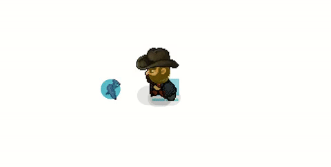
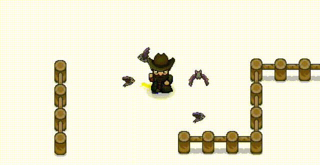

# Requirements

## Using Git LFS

This project uses Git LFS (Large File Storage) to handle large files. Before cloning or working with the repository, make sure you have Git LFS installed on your machine.

### Installing Git LFS

You can download Git LFS from [here](https://git-lfs.github.com/), or by executing the following command in a terminal:

```
git lfs install
```

After installing Git LFS, the large files in this repository will be automatically handled. No additional configuration is needed.

# Goal

The goal of this project is to practice common game development processes for curiosity. For this, Godot 4.2.1 is being used. Random topics are chosen based on personal interests. Everything shall be considered an endless work in progress with no coherence or expectations. References to the used tutorials / guides / documentations will be ommitted for now; the point is to make this a quick and enjoyable exploration with backups behind.

# Experiments

<center>

---

**E001:** 2D in 3D


---

**E002:** Obligatory Minecraft Terrain Generator

    

---

**E003:** 2D Lighting Room


---

**E004:** Cinema Room


---

**E005:** Farming Room


---

**E006:** Human-Held Camera Effect + RNG Batch Growth for Plants + Plant bending

    

  

10,000 reactive plants!

---

**E007:** Melee Attacking + Particles

    

---

**E008:** Basic Pathfinding


---

**E009:** Basic Context-Map and Steering AI

 

I'm Batman now

---

**E010:** Smarter Lucas + Main Menu Mockup + Project Structure

  

Got busy all month editing and publishing my newest book: "Alcarodian Tales, Evergreen", Spanish edition. The Kindle and English editions will come out soon too, free for 5 days every 3 months in Amazon, might get busy again. Could only work on a few things meanwhile, like tweaking Lucas' pathfinding, but it needs more work, he flickers badly when touching the edge of his navigation area. There are plenty of fixes, but I am deciding which one could be best, the most "realistic" one. Same for the project's structure, I know it'd be exageratted for a 2D game like this, but I want to learn what it would be like to manage such a project, those that aim to simulate real life as close as possible.

For the menu, I plan to learn how to animate it either in the engine or outside, whatever is best, and try to adapt it with a fictional company intro and this song I liked: https://uppbeat.io/track/all-good-folks/quantum-fire see how it goes.

---

E###: Basic AI / UI / Menus & Options / Audio / Save & Load / Pause / Inventory / Cooking & Crafting Features / Scene Transitions / Code Style & Structure Remake

[TBA]

---

E###: Rimworld / Sims Personalities / Sims Autonomy / Multiplayer or Online Features / Stamina & Breathing Synced Running Animation / Attack Fixes, Remake

[TBA]

---

E###: Advanced AI / Pathfinding / UIs / Plugins / Procedural / Dungeons / Building / Enemies / Dialogues / Quests / General Gameplay / General Fixes

[TBA]

---

E###: Advanced Shaders / ML / Binary, Priority Trees / Simulations / VFX / 2D, 3D Procedural or Adaptive Animation / Behavior / Develop a Decent Mod for a Big Game

[TBA]

---

E###: Create own tools / Create own plugins and addons / Create own engine

[TBA]

---

Resources:

Milo's journey and books: [https://github.com/miloyip/game-programmer](https://github.com/miloyip/game-programmer "A Study Path for Game Programmer")
