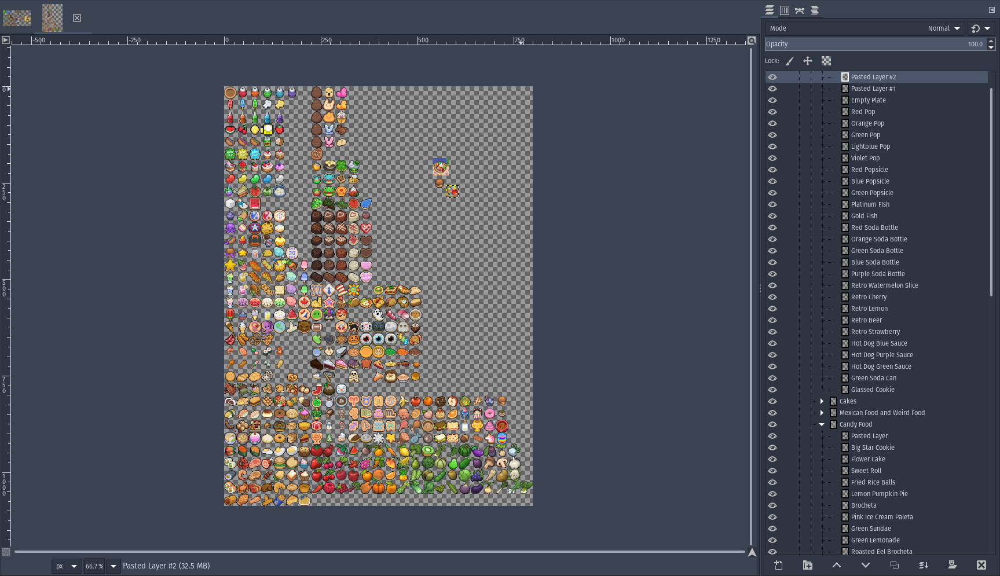

# Requirements

## Using Git LFS

***Skippable: Currently it's only needed for a single 4K skybox image that's over 40MB, but might need it for heavier assets later.***

This project uses Git LFS (Large File Storage) to handle large files. Before cloning or working with the repository, make sure you have Git LFS installed on your machine.

### Installing Git LFS

You can download Git LFS from [here](https://git-lfs.github.com/), or by executing the following command in a terminal:

```
git lfs install
```

After installing Git LFS, the large files in this repository will be automatically handled. No additional configuration is needed.

# Goal

The goal of this project is to practice common game development processes for curiosity. For this, Godot 4.2.1 is being used. Random topics are chosen based on personal interests. Everything shall be considered an endless work in progress with no coherence or expectations. References to the used tutorials / guides / documentations will be ommitted for now; the point is to make this a quick and enjoyable exploration with backups behind.

# Experiments

<center>

---

**E001:** 2D in 3D


---

**E002:** Obligatory Minecraft Terrain Generator

    

---

**E003:** 2D Lighting Room


---

**E004:** Cinema Room


---

**E005:** Farming Room


---

**E006:** Human-Held Camera Effect + RNG Batch Growth for Plants + Plant bending

    

  

10,000 reactive plants!

---

**E007:** Melee Attacking + Particles

    

---

**E008:** Basic Pathfinding


---

**E009:** Basic Context-Map and Steering AI

 

I'm Batman now

---

**E010:** Smarter Lucas + Main Menu Mockup + Project Structure

  

Got busy all month editing and publishing my newest book: "Tales of Alcarodia, Evergreen", Spanish edition. The Kindle and English editions will come out soon too, free for 5 days every 3 months in Amazon, might get busy again. Could only work on a few things meanwhile, like tweaking Lucas' pathfinding, but it needs more work, he flickers badly when touching the edge of his navigation area. There are plenty of fixes, but I am deciding which one could be best, the most "realistic" one. Same for the project's structure, I know it'd be exageratted for a 2D game like this, but I want to learn what it would be like to manage such a project, those that aim to simulate real life as close as possible. Also, I made an idle spritesheet of the pug, there were none online, in case anyone wants it. Both the png and GIMP's xcf are at ***Labs/Assets/X. Resources/Animals/lucas idle sheet final***

For the menu, I plan to learn how to animate it either in the engine or outside, with a big broken planet and clock behind the title and a massive sword tearing them apart in pieces, raining black leaves or particles slowly in the background; for now it's as bare-naked as it can get. I wanna try to time it well after a slow fictional company intro and the starting high notes of this song I liked, which kind of captures the ambience I'd love to make: https://uppbeat.io/track/all-good-folks/quantum-fire see how it goes.

---

**E011:** TileSets and TileMaps

 

This was easily the most insane "experiment" (torture) of them all. I can see now why they say art asset generation takes the longest. Even with already-existing assets from a game I have high regards to, Graal Online Classic, it took me almost the entire month to complete just enough for one level or tilemap. Organized and separated hundreds of assets with cool 2D pixel art (from all 4 games, Classic - Medieval Fantasy, Era - Grand Theft Auto on the phone, OlWest - Old West, Zone - Futuristic) that I'd obviously never publish unless I hired 2D artists to redraw them all, but that I plan to use to learn for now nonetheless. If it ever came down to it, it'd be poetic to do what they did with Zelda a Link to the Past; I'd be creating my own Graal, but with blackjack and hookers.

At least did all this while working on the book on the side, which made it enjoyable. Check them out if you like high fantasy!
"Tales of Alcarodia, Evergreen" - https://www.amazon.com/dp/B0CW1LX5W1
"Cuentos Alcarodianos, Evergreen" - https://www.amazon.com.mx/dp/B0CZ3X8BHX

I always put the digital versions (eBooks) for free 5 days every 3 months~

---

**E012:** Collectables


---

**E013:** Modular Inventory System

|  |  |
| ------------------------------------------------------------------------------------------------------------------------------------------------------- | ------------------------------------------------------------------------------------------------------------------------------------------------------- |

Followed YouTuber Calame321's Modular Inventory System tutorial (https://youtu.be/dMYv6InQgno?si=YqIiAl5yCIHZYhw0), which was mind-blowing. It might appear as a tutorial focused on just the UI and inventory, but it actually teaches you how to pretty much build an entire game, with only the music, enemies, animations and plot missing, that's it. In just 10 hours, I felt I learnt what schools and job experiences teach you in hundreds. Throughout two weeks I followed him, writing and listening at my own pace, absorbing as much as I could to understand the system, not just copy and paste it. So far, I feel I grasped a good amount, half of it, which is allowing me to easily connect it in the project I have. I'd just need to expand it with a new interactable system. I am thinking of adding an "interact()" and "interact_with(item)" functions to every interactable object or NPC in the game, saved in a JSON as an array of ENUMS "interacts_with" or something similar. With this, I think I could easily create modular and editable interactions with almost absolutely anything, maybe, I'll find out.

---

**E014:** Save & Load


---

**E015:** Crafting, Shop, Item Stats, Cooldowns & Random Loot

    

---

**E016: Movement System Refactor and Documentation**

| <br /><br /> |  |
| --------------------------------------------------------------------------------------------------------------------------------------------------------------------------------------------------------------------------------------------------------------------------------------------------------------------------------------------------------------------------------------------------------------------------------------------------------------------------------------------------------------------------------------- | ------------------------------------------------------------------------------------------------------------------------------------------------------------------------- |

I finally did something I have wanted to do for a long time: modularize an NPC or Player Character in a scalable way, make it work like a real human body. Now, the player's character, instead of being one single massive script file, it is now made up of reusable components that define what the entity is. For example, the new BodyComponent allows to build/structure bodies of any kind, like a human with missing limbs, a bat, a dog, or anything really. It is also responsible for detecting inputs, whatever the limbs touch or interact with, and carrying accessories (separately on each limb to make it easier to move them along the same time) and equipment like tools and weapons. The idea of the HealthComponent is to allow for some interesting features like diseases or potion effects in the future; might need to move the entity's stats here for that. The PlayerControllerComponent is for the player to move the current entity it's attached to (could be one or multiple, this is still WIP and way too far ahead). I plan to create an AIControllerComponent for everything else to be controlled as NPCs, using the state_machines created in E009.

Also had a SoulComponent that held the entity's stats and was supposed to hold the personality or whatever defined the entity, but then decided to deprecate it, because souls do not exist. We are all robots. All of us. Yeah, including you.

All of these components communicate with the "brain" first, the entity's main script, which defines its unique methods if there are any, specially for protagonist characters or so. NPCs would inherit default values from a class named "Human" or whichever entity they are, and probably randomly choose/generate the sprites to use for its appearance. The sprites could be color-indexed, to allow choosing and setting random colors in them; skin color, clothes, everything. Finally, the LoreComponent holds simple TXT files that describe the entity or narrate recorded tales and adventures. I decided to avoid JSONs or CVs on purpose, because I am trying to build all these things with speed in mind, and I think TXT files and get_line() is as bare bones as it can get. All this is still far from perfect, but my goal is to pave the way to learn the most advanced techniques used in Game Dev or coding in general more comfortably, and I think I am almost ready, if not, already.

Also played with Godot's documentation tools to document everything done in this experiment as best as I could. They are awesome.

---

E###: Basic AI / UI / Menus & Options / Audio / Save & Load / Pause / Inventory / Cooking & Crafting Features / Scene Transitions / Code Style & Structure Remake

[TBA]

---

E###: Rimworld / Sims Personalities / Sims Autonomy / Multiplayer or Online Features / Stamina & Breathing Synced Running Animation / Attack Fixes, Remake

[TBA]

---

E###: Advanced AI / Pathfinding / UIs / Plugins / Procedural / Dungeons / Building / Enemies / Dialogues / Quests / General Gameplay / General Fixes

[TBA]

---

E###: Advanced Shaders / ML / Binary, Priority Trees / Simulations / VFX / 2D, 3D Procedural or Adaptive Animation / Behavior / Develop a Decent Mod for a Big Game

[TBA]

---

E###: Create own tools / Create own plugins and addons / Create own engine

[TBA]

---

Resources:

Milo's journey and books: [https://github.com/miloyip/game-programmer](https://github.com/miloyip/game-programmer "A Study Path for Game Programmer")
